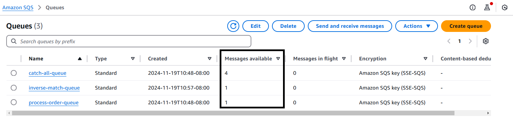
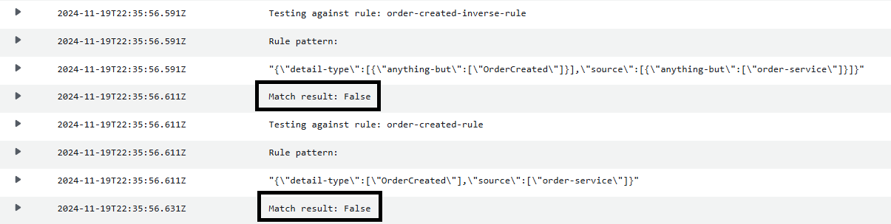
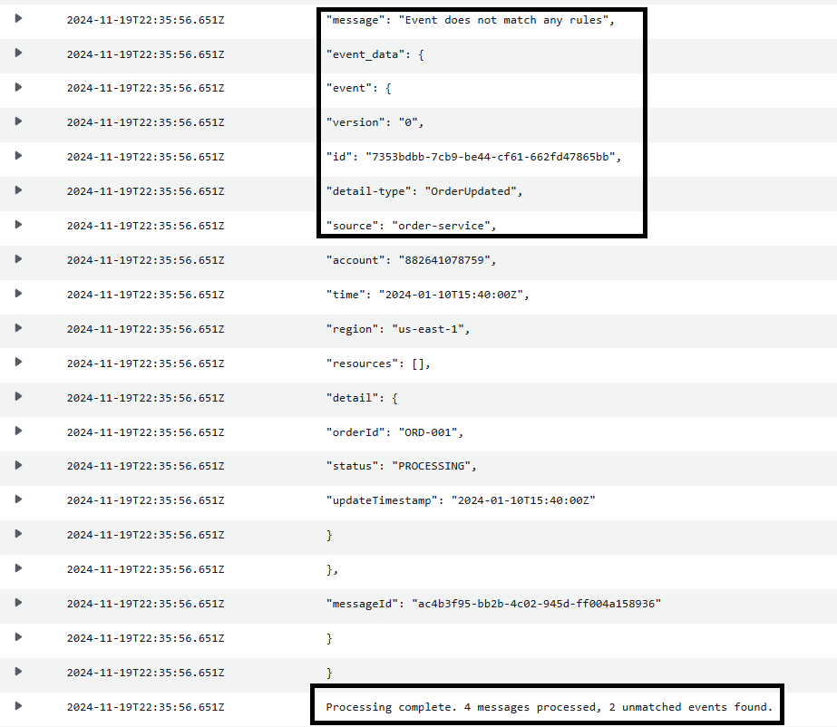

# Handling Unmatched Events in EventBridge

When using EventBridge, operational teams need visibility into events that don't match any defined rules. While EventBridge doesn't natively support catching unmatched events, teams often create "inverse" rules that match everything not matched by other rules. However, this approach has several challenges:

- Prone to developer errors
- Complex to maintain as rules grow
- May miss corner cases
- Vulnerable to unexpected data formats

This project implements a more robust solution for catching unmatched events

## Example Scenario
This project demonstrates the challenges with the inverse rule approach using a sample event bus with three rules:

1. `order-created-rule`: Matches specific order creation events
2. `order-created-inverse-rule`: Attempts to match events not matching the first rule
3. `catch-all-rule`: Matches all events regardless of payload or source

### Test Events Behavior
The project includes 4 test events (see `events/` directory) sent via `testEvents.sh`. While these events should trigger either the main rule or inverse rule (total 4 invocations), a bug in the inverse rule causes 2 events to be unmatched:

- The inverse rule uses an "AND" condition instead of "OR"
- As rules grow more complex, such logical errors become more common and harder to detect


### Solution Implementation
This project implements a more robust solution for catching unmatched events:

1. A Lambda function runs on-demand (not directly mapped to SQS)
2. The function:
   - Retrieves all messages from the catch-all SQS queue
   - Fetches all rules defined on the event bus
   - For each message, tests against all rule patterns (except catch-all) using the [test_event_pattern API](https://boto3.amazonaws.com/v1/documentation/api/latest/reference/services/events/client/test_event_pattern.html)
   - Identifies truly unmatched events (those matching no patterns)
   - Logs unmatched events to CloudWatch

### Extension Possibilities
The solution can be extended to:
- Move unmatched events to a dedicated DLQ
- Set up alerts for unmatched events
- Generate metrics and dashboards
- Implement automated pattern analysis

## Usage Instructions

### Prerequisites
- AWS CLI installed and configured
- Appropriate AWS permissions to create EventBridge, SQS, and Lambda resources

### Deployment

1. Deploy the stack:
   ```bash
   ./deployStack.sh
   ```

2. Test event routing:
   ```bash
   ./putOrderEvents.sh
   ```
   This will send sample events from the `events/` directory to test different routing patterns.

   View the SQS queues to verify the events routed to them.

   

3. Invoke lambda function to identify any unmatched events
   ```bash
   aws lambda invoke  --function-name catchall-analyzer  response.json
   ```

4. View CloudWatch logs to review unmatched events
   
   

   

### Managing Queues

To purge all queues:
```bash
./purgeQueues.sh
```

## Sample Events

The project includes example events in the `events/` directory:
- `orderCreated.json`: Standard order creation event
- `unmatched-different-detail-type.json`: Event with different detail type for testing inverse matching
- Other test events for various routing scenarios

## Event Routing Patterns

1. **Direct Match**:
   - Events with `detail-type: "OrderCreated"` and `source: "order-service"`
   - Routed to Process Order Queue

2. **Inverse Match**:
   - Events from `source: "order-service"` but not "OrderCreated"
   - Routed to Inverse Match Queue

3. **Catch-all**:
   - All other events
   - Processed by Lambda and routed to Catch-all Queue

## Cleanup

To remove all resources created by this stack:
```bash
./cleanup.sh
```

This will delete the CloudFormation stack and all associated resources.